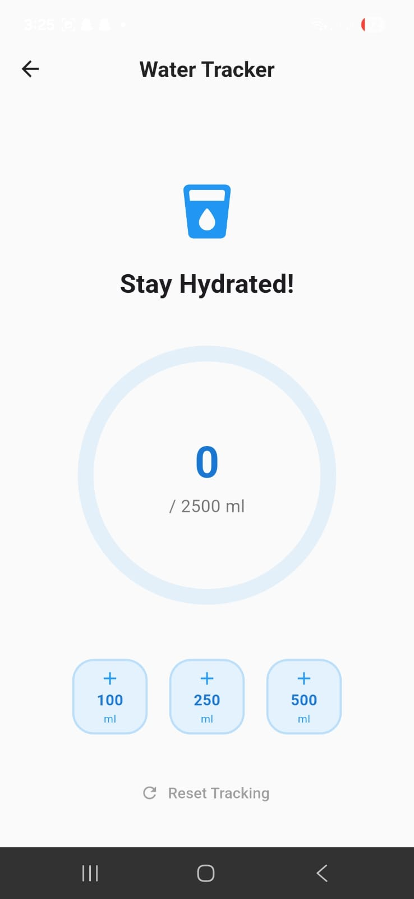
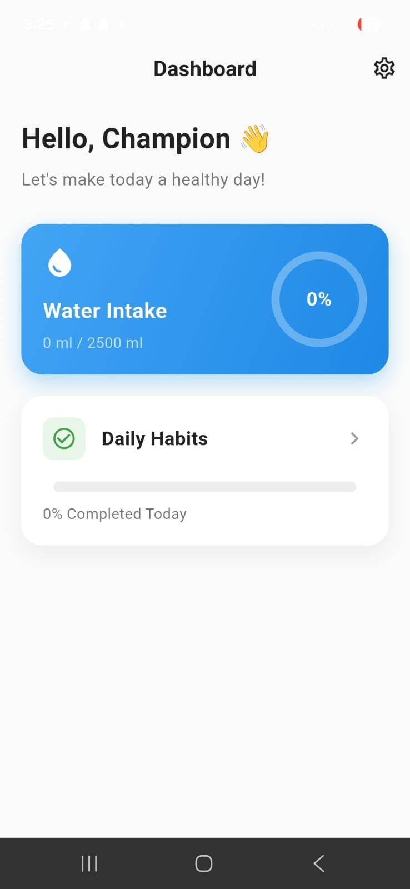
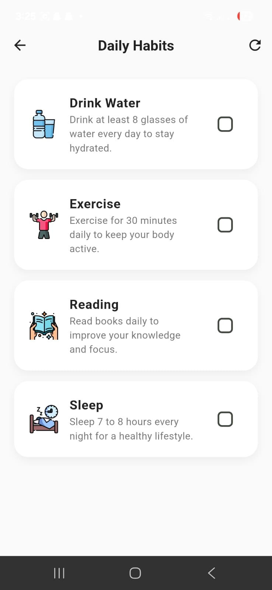
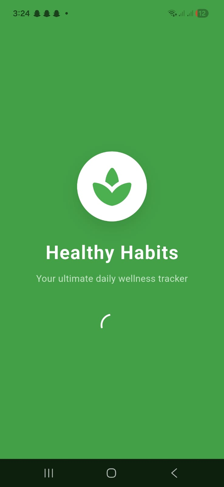
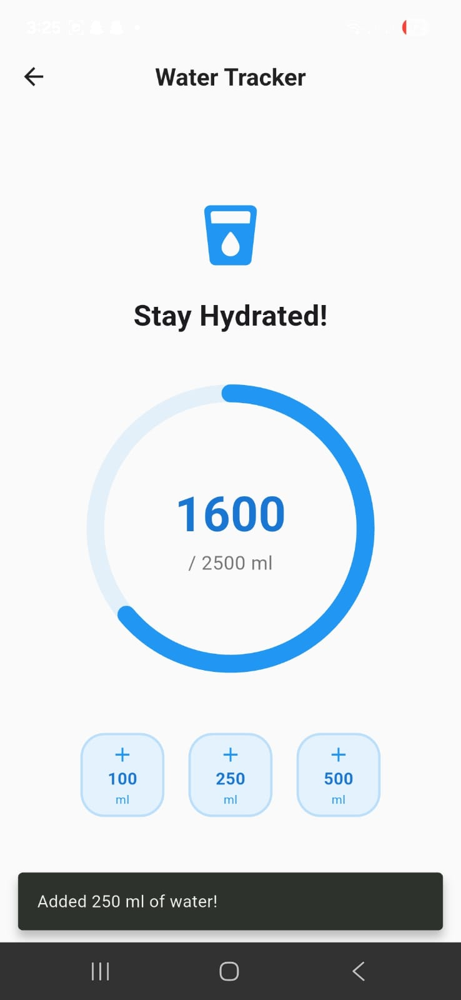

# Healthy Habits Pro

Healthy Habits Pro is a beautifully designed, intuitive habit and water tracking application built with Flutter. It seamlessly integrates daily habit tracking with focused water intake monitoring to help users maintain a healthy and balanced lifestyle.

## 🚀 Features

- **Water Intake Tracker**:
  - Set a daily hydration goal (default 2.5L).
  - Add water intake in customizable increments.
  - Visualize your hydration progress with clean percentage indicators.
  - Reset daily intake easily.

- **Daily Habits Tracker**:
  - Track predefined daily habits like Drinking Water, Exercising, Reading, and Sleeping.
  - Interactive checklists to mark habits as completed.
  - Visual progress bar showing your daily habit completion rate.

- **Polished UI/UX**:
  - Beautiful starting Splash Screen.
  - Custom typography using Google Fonts (Inter).
  - Modern, clean, and responsive user interface across all screen sizes.

## 🛠 Technology Stack

- **Framework:** [Flutter](https://flutter.dev/) (SDK ^3.11.0)
- **Language:** [Dart](https://dart.dev/)
- **State Management:** Provider
- **Key Packages:**
  - `provider` - For robust reactive state management.
  - `google_fonts` - For high-quality typography.
  - `percent_indicator` - For circular and linear progress visualizers.
  - `shared_preferences` - For potential local data persistence.
  - `cupertino_icons` - For iOS style icons.

## 📱 Screenshots

*(Add your app screenshots here by replacing these placeholders or removing this section)*



 |  |  |  | | |  

## ⚙️ How to Run

Follow these steps to run the application on your local machine.

### Prerequisites
- Install [Flutter SDK](https://docs.flutter.dev/get-started/install)
- Ensure you have a device connected (Emulator or Physical Android/iOS device).
- Install an IDE like Android Studio, VS Code, or IntelliJ.

### Installation

1. **Clone the repository:**
   ```bash
   git clone https://github.com/your-username/healthy-habits-pro.git
   ```

2. **Navigate into the project directory:**
   ```bash
   cd healthy-habits-pro  # Or whatever your folder name is
   ```

3. **Get Flutter dependencies:**
   ```bash
   flutter pub get
   ```

4. **Run the app:**
   ```bash
   flutter run
   ```

## 📂 Project Structure

- `lib/main.dart` - Application entry point.
- `lib/providers/app_state_provider.dart` - Central state management handling water and habits logic.
- `lib/models/habit.dart` - Data model for a daily habit.
- `lib/screens/` - Contains the UI for Splash, Home, Water Tracker, and Habit Tracker screens.

## 🤝 Contributing
Contributions, issues, and feature requests are welcome! Feel free to check the [issues page](https://github.com/your-username).

## 📝 License
This project is made only by Muhammad Huzaifa
